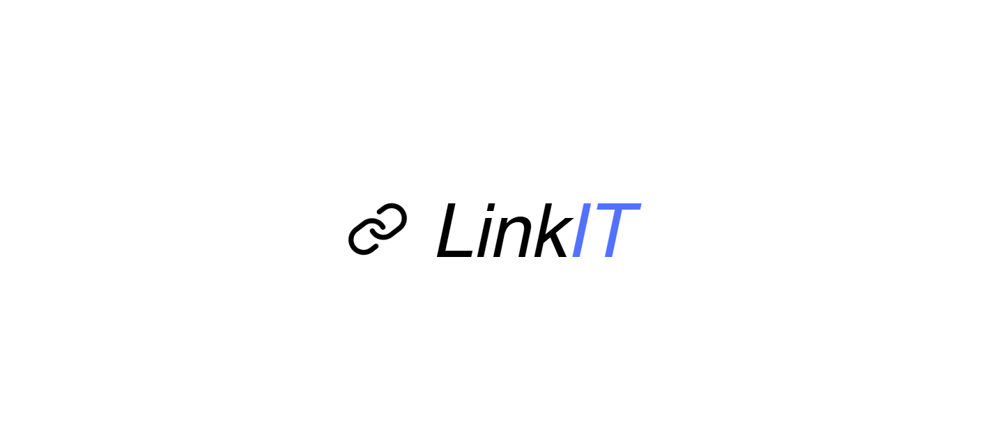
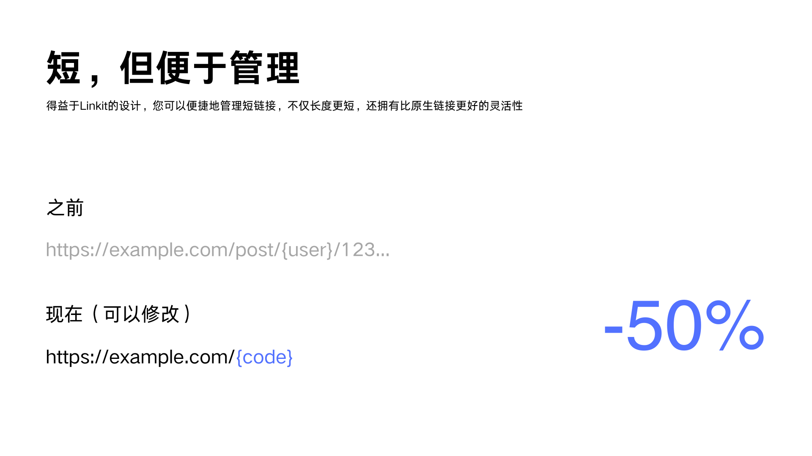

<p align="center">
  
</p>

<h1>Linkit</h1>

<p align="center">
简体中文 | <a href="README_EN.md">English</a>
</p>

<p align="center">


<a href="https://redocly.github.io/redoc/?url=https://raw.githubusercontent.com/shuakami/linkit/master/docs/api.yaml"></a>
</p>

这是一个使用 Go 语言开发的高性能短链接服务系统，采用领域驱动设计（DDD）和整洁架构（Clean Architecture）实现。

它不仅提供基本的短链接功能，还支持智能跳转和详细的访问统计，帮助企业更好地管理和分析链接数据。

## 产品特性

<p align="center">
  
</p>

<p align="center">
  
</p>

## 核心功能

- **短链接生成**：支持长链接转短链接，支持自定义短码。
- **智能跳转**：根据访问者的设备类型、地理位置等条件进行智能跳转。
- **访问统计**：提供详细的访问数据统计，包括访问次数、来源、设备类型等。
- **安全管理**：支持链接过期时间设置和访问次数限制，确保链接安全。

## 技术架构

Linkit 采用了现代化的技术栈，确保系统的高性能和可扩展性：

- **Web 框架**：Gin - 轻量高效，适合高并发场景。
- **数据库**：PostgreSQL - 强大的数据存储和查询能力。
- **缓存**：Redis - 多级缓存策略，提升系统响应速度。
- **架构设计**：DDD + Clean Architecture - 业务逻辑清晰，易于维护和扩展。

## 快速开始

以下是快速启动 Linkit 服务的步骤：

1. 克隆项目到本地：
   ```bash
   git clone https://github.com/yourusername/linkit.git
   cd linkit
   ```

2. 环境准备：
   - 安装 Go 1.21+
   - 安装 PostgreSQL 14+
   - 安装 Redis 7+
   - 安装 Docker（可选）

3. 配置服务：
   ```bash
   cp configs/config.example.yaml configs/config.yaml
   vim configs/config.yaml
   ```
   修改配置文件中的数据库和 Redis 连接信息。

4. 启动服务：
   选择以下任意一种方式启动服务：
   - 使用 Docker：
     ```bash
     docker-compose up -d
     ```
   - 手动启动：
     ```bash
     go mod download
     go run scripts/migrate.go
     go run cmd/main.go
     ```

访问 http://localhost:8080 查看 API 文档，开始使用 Linkit。

> 如果你觉得这个项目对你有帮助，那就给个Star呗~
