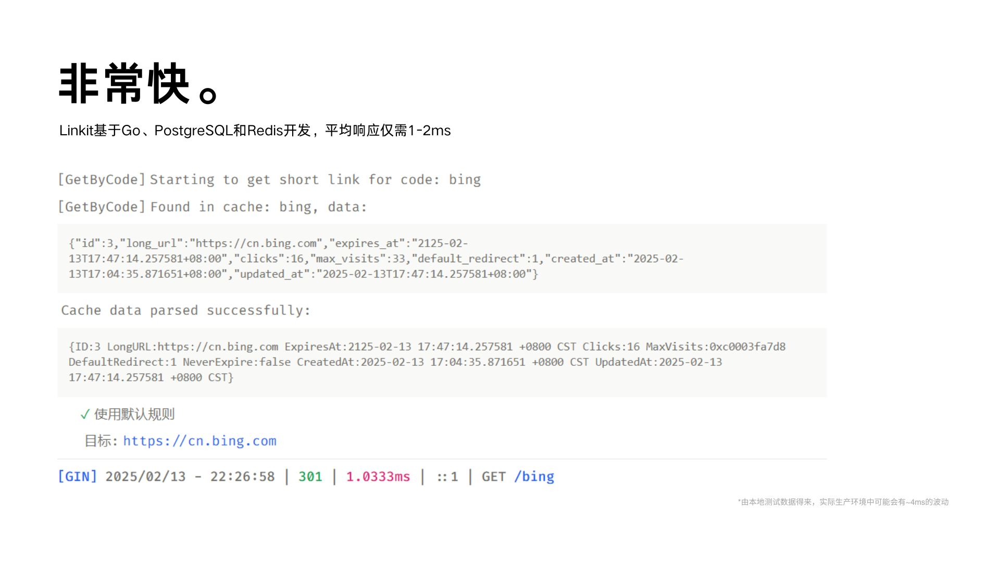
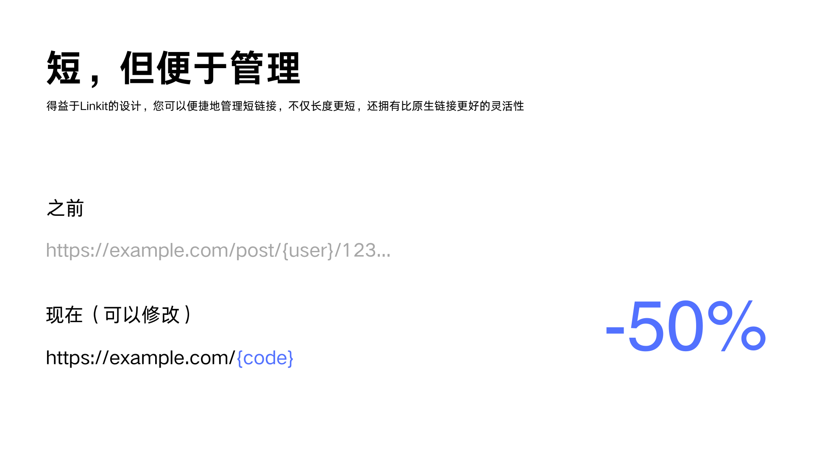

<p align="center">
  
</p>

<h1>Linkit</h1>

<p align="center">
<a href="README.md">简体中文</a> | English
</p>

<p align="center">


<a href="https://redocly.github.io/redoc/?url=https://raw.githubusercontent.com/shuakami/linkit/master/docs/api.yaml"></a>
</p>

A high-performance URL shortening service system developed in Go, implemented using Domain-Driven Design (DDD) and Clean Architecture principles.

It not only provides basic URL shortening functionality but also supports intelligent redirection and detailed access statistics to help businesses better manage and analyze link data.

## Features

<p align="center">
  
</p>

<p align="center">
  
</p>

## Core Features

- **URL Shortening**: Support for converting long URLs to short ones, with custom short code options.
- **Smart Redirection**: Intelligent redirection based on visitor's device type, geographic location, and other conditions.
- **Access Analytics**: Detailed access statistics including visit counts, sources, device types, etc.
- **Security Management**: Support for link expiration time settings and access count limits to ensure link security.

## Technical Architecture

Linkit uses a modern technology stack to ensure high performance and scalability:

- **Web Framework**: Gin - Lightweight and efficient, suitable for high-concurrency scenarios.
- **Database**: PostgreSQL - Powerful data storage and query capabilities.
- **Cache**: Redis - Multi-level caching strategy to improve system response speed.
- **Architecture Design**: DDD + Clean Architecture - Clear business logic, easy to maintain and extend.

## Quick Start

Follow these steps to quickly start the Linkit service:

1. Clone the project locally:
   ```bash
   git clone https://github.com/yourusername/linkit.git
   cd linkit
   ```

2. Environment preparation:
   - Install Go 1.21+
   - Install PostgreSQL 14+
   - Install Redis 7+
   - Install Docker (optional)

3. Configure the service:
   ```bash
   cp configs/config.example.yaml configs/config.yaml
   vim configs/config.yaml
   ```
   Modify the database and Redis connection information in the configuration file.

4. Start the service:
   Choose either of the following methods to start the service:
   - Using Docker:
     ```bash
     docker-compose up -d
     ```
   - Manual start:
     ```bash
     go mod download
     go run scripts/migrate.go
     go run cmd/main.go
     ```

Visit http://localhost:8080 to view the API documentation and start using Linkit.

> If you find this project helpful, please consider giving it a star! 